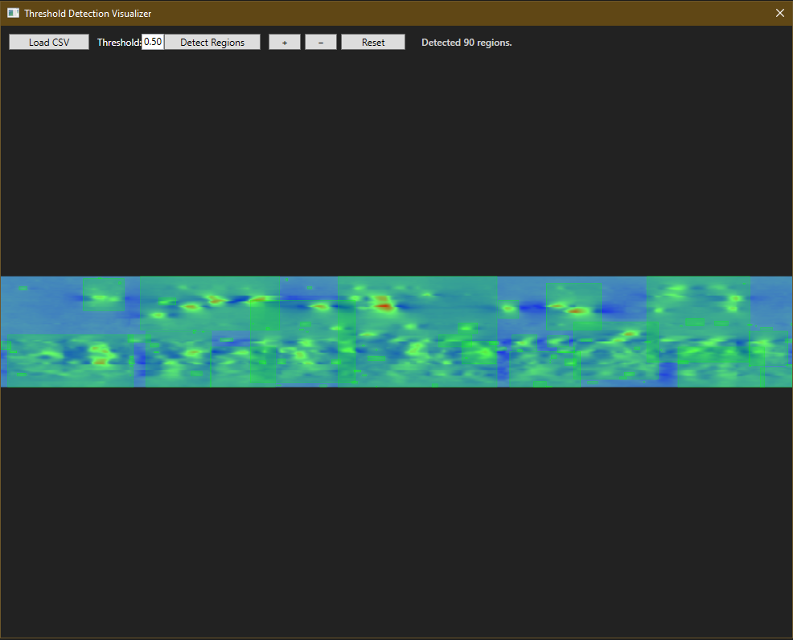

# Threshold Detection App

A WPF-based application for visualizing heatmaps and detecting thresholds in images. The app overlays detected regions on heatmaps, allows zooming and panning, and provides an interactive interface for exploring detection results.

---

## Table of Contents

- [Features](#features)  
- [Screenshots](#screenshots)  
- [Installation](#installation)  
- [Usage](#usage)  
- [Configuration](#configuration)  
- [Architecture](#architecture)  

---

## Features

- Load and display heatmap images.  
- Overlay detection boxes on heatmaps with adjustable thresholds.  
- Fit images to window resolution for easy viewing.  
- Zoom and pan support for detailed inspection.  
- Interactive toolbar for threshold input and controls.  
- High-resolution bitmap rendering for clear visualization.  

---

## Screenshots



- Heatmap with overlay boxes  
- Toolbar and threshold input  
- Zoomed/panned image view  

---

## Installation

### Prerequisites

- Windows 10 or later  
- [.NET 7 Runtime](https://dotnet.microsoft.com/en-us/download/dotnet/7.0)  
- Visual Studio 2022 or later (for building from source)  

### Steps

1. Clone the repository:  
   ```bash
   git clone https://github.com/yousefabodeif2000/ThresholdDetectionApp.git
   ```  
2. Open the solution in Visual Studio.  
3. Restore NuGet packages.  
4. Build and run the project.  

---

## Usage

1. Launch the application.  
2. Load a CSV file containing your 2D matrix.  
3. Adjust the detection threshold to highlight areas of interest then click Detect Regions.  
4. Use zoom and pan controls to navigate the image.  

---

## Configuration

- **Threshold Input:** Enter a numeric value (supports decimals) to define the detection threshold.  
- **Reset** Automatically scales the heatmap to the current window size while maintaining aspect ratio.  

---

## Architecture

- **WPF MVVM Pattern**: Separation of concerns between UI and business logic.  
- **ViewModels**: Handle application state, heatmap image, and detection results.  
- **Views**: XAML-based UI with Canvas overlays for visualization.  
- **Models**: Data structures for detected regions, pixel data, and image metadata.  
- **Utilities**: Bitmap rendering and image processing helpers.  

